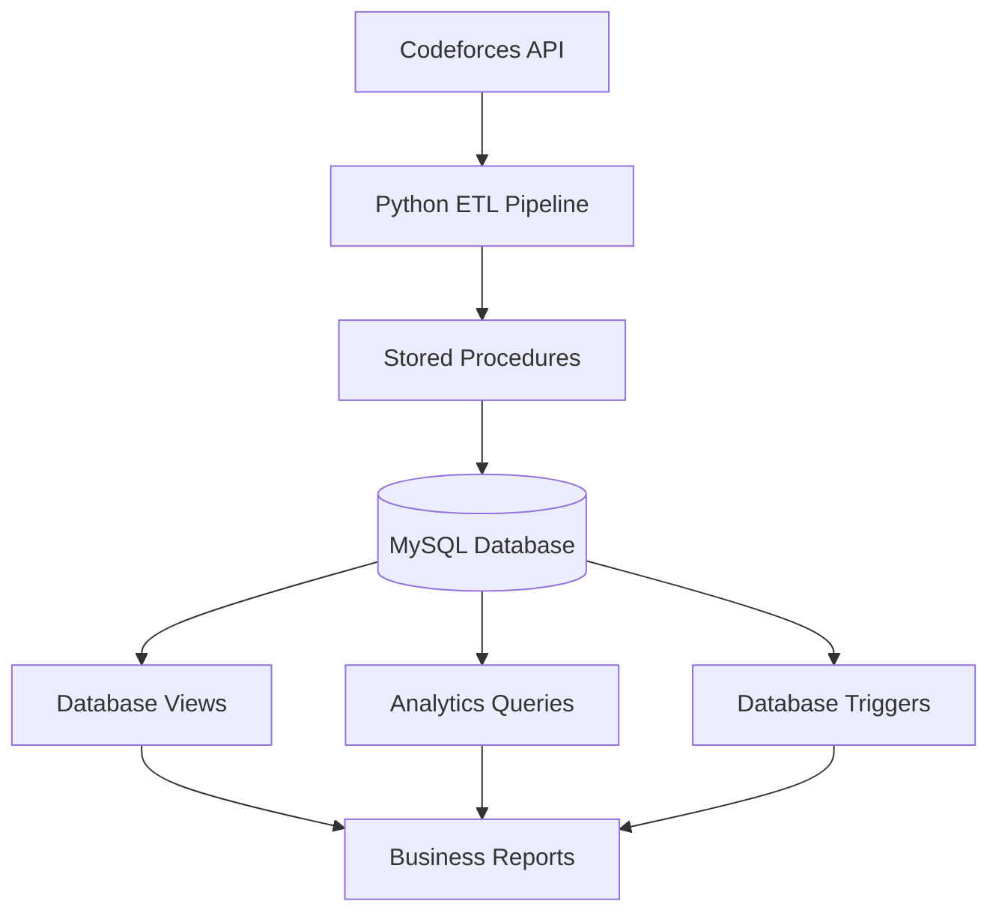

# Codeforces Analytics Platform

**Competitive Programming Data Engineering & Analytics System**

A database-centric platform that automates the collection, storage, and analysis of Codeforces data through a fully integrated ETL pipeline built with Python and MySQL.

---

Python • MySQL • SQL • ETL • REST API • Data Analytics

## Overview

Competitive programming platforms generate a massive amount of valuable data every day—contest participation, problem solving patterns, rating changes, submission statistics, and language usage.

The **Codeforces Analytics Platform** transforms this raw data into a structured relational database capable of supporting analytical queries and reporting. Using the official Codeforces API, the platform automatically extracts data, processes it through Python ETL pipelines, and stores it in a normalized MySQL database designed for efficient querying and future scalability.

The project demonstrates practical applications of database engineering, SQL programming, API integration, and data pipeline development using real-world data.

## Core Capabilities

| Capability | Description |
|------------|-------------|
| Automated Data Collection | Retrieves live data directly from the official Codeforces API |
| ETL Pipeline | Extracts, transforms and loads data into MySQL |
| Relational Database | Stores normalized contest, user and submission data |
| SQL Programming | Implements Views, Stored Procedures and Triggers |
| Analytics | Generates meaningful insights through SQL queries |
| Data Integrity | Prevents duplicate records through reusable upsert procedures |

## Tech Stack

### Database
- MySQL 8

### Backend
- Python 3

### Libraries
- mysql-connector-python
- requests
- python-dotenv

### APIs
- Codeforces API

### Version Control
- Git
- GitHub

## System Architecture

## Database Schema

### Users

Stores user profile information including

- Handle
- Ratings
- Contribution
- Organization
- Country
- Friend Count

---

### Contests

Stores contest metadata

- Contest ID
- Contest Name
- Contest Type
- Contest Phase
- Duration

---

### Problems

Stores contest problems

- Problem Index
- Rating
- Points
- Type

---

### Submissions

Stores submission history

- Verdict
- Language
- Execution Time
- Memory Usage

---

### Rating History

Stores rating changes after every contest.

---

### Tags

Stores problem tags.

---

### Problem Tags

Many-to-many relationship between Problems and Tags.

codeforces-analytics-platform/

data/

docs/

python/

database/

etl/

api/

utils/

sql/

01_database.sql

02_tables.sql

03_constraints.sql

04_indexes.sql

05_views.sql

06_procedures.sql

07_triggers.sql

08_queries.sql

09_analytics.sql

User Handle
      │
      ▼

Users API

Contest API

Problemset API

User Status API

Rating API

      │

      ▼

Python ETL

      ▼

Stored Procedures

      ▼

MySQL Database

## Database Objects

### Tables

- Users
- Contests
- Problems
- Tags
- Problem Tags
- Submissions
- Rating History

### Views

- User Profile
- Submission Details
- Contest Summary
- Problem Statistics
- User Statistics
- Contest Statistics
- Rating History
- Problem Details

### Stored Procedures

- User Upsert
- Contest Upsert
- Problem Upsert
- Tag Upsert
- Add Problem Tag
- Add Submission
- Add Rating History

### Triggers

Database automation triggers for maintaining integrity and timestamps.

## API

Official Codeforces API

Endpoints Used

- user.info
- contest.list
- problemset.problems
- user.status
- user.rating

## Setup

Clone Repository

Install Dependencies

pip install -r requirements.txt

Configure .env

Run

python main.py

## Current Dataset

Users : 1

Contests : 2138

Problems : 10000+

Submissions : 4746

Rating History : 306

## Future Improvements

- Bulk User Import
- Interactive Dashboard
- Power BI Reports
- Machine Learning Based Performance Prediction
- User Comparison
- Contest Recommendation System
- Scheduled ETL Jobs

## Author

Harsh Pandit

GitHub:
https://github.com/HAKUPA11

LinkedIn:

