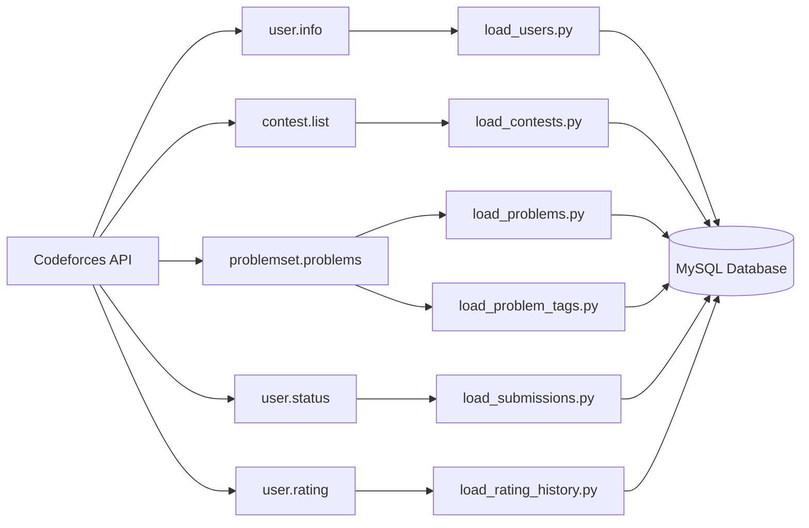
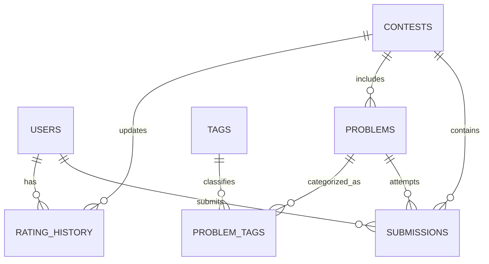

<div align="center">

# Codeforces Analytics Platform

**Competitive Programming Data Engineering & Analytics System**

A database-centric platform that automates the collection, storage, and analysis of Codeforces data through a fully integrated ETL pipeline built with Python and MySQL.

---

Python • MySQL • SQL • ETL • REST API • Data Analytics

</div>


## Overview

Competitive programming platforms generate a massive amount of valuable data every day—contest participation, problem solving patterns, rating changes, submission statistics, and language usage.

The **Codeforces Analytics Platform** transforms this raw data into a structured relational database capable of supporting analytical queries and reporting. Using the official Codeforces API, the platform automatically extracts data, processes it through Python ETL pipelines, and stores it in a normalized MySQL database designed for efficient querying and future scalability.

The project demonstrates practical applications of database engineering, SQL programming, API integration, and data pipeline development using real-world data.

## Core Capabilities

| Capability | Description |
|------------|-------------|
| Automated Data Collection | Retrieves live data directly from the official Codeforces API |
| ETL Pipeline | Extracts, transforms and loads data into MySQL |
| Relational Database | Stores normalized contest, user and submission data |
| SQL Programming | Implements Views, Stored Procedures and Triggers |
| Analytics | Generates meaningful insights through SQL queries |
| Data Integrity | Prevents duplicate records through reusable upsert procedures |

## Tech Stack

### Database
- MySQL 8

### Backend
- Python 3

### Libraries
- mysql-connector-python
- requests
- python-dotenv

### APIs
- Codeforces API

### Version Control
- Git
- GitHub

## ETL Workflow



> **Note:** A detailed database schema, table definitions, constraints, and relationship descriptions are available in [`docs/Database_Schema.md`](docs/Database_Schema.md).
## Database Schema

The platform is built on a **normalized relational database** designed to efficiently manage competitive programming data while maintaining referential integrity. The schema consists of **seven core entities** connected through foreign key relationships, enabling efficient querying and analytical reporting.

### Entity Overview

| Table | Description | Primary Key |
| :----- | :---------- | :---------- |
| `users` | Stores Codeforces user profiles, ratings, organizations, and account metadata. | `user_id` |
| `contests` | Maintains contest information including contest type, phase, duration, and schedule. | `contest_id` |
| `problems` | Contains contest problems along with rating, points, difficulty, and metadata. | `problem_id` |
| `tags` | Stores the master list of problem tags used for categorization. | `tag_id` |
| `problem_tags` | Junction table implementing the many-to-many relationship between problems and tags. | `(problem_id, tag_id)` |
| `submissions` | Records user submissions, verdicts, execution time, memory usage, and programming language. | `submission_id` |
| `rating_history` | Stores historical rating updates after every rated contest. | `rating_history_id` |

---

### Entity Relationships



---

### Design Highlights

- Database follows **Third Normal Form (3NF)** to eliminate redundancy and improve maintainability.
- **Primary Keys** uniquely identify every entity.
- **Foreign Keys** enforce referential integrity across related tables.
- **Stored Procedures** are used for controlled insertion and update operations.
- **Views** simplify analytical reporting by exposing pre-joined datasets.
- **Triggers** automate timestamp management and maintain database consistency.
- The schema is designed to support efficient analytical queries while remaining scalable for future enhancements.


## Project Structure

The project is organized into independent modules, separating database scripts, ETL pipelines, API integrations, documentation, and datasets. This modular architecture improves maintainability, scalability, and ease of development.

```text
codeforces-analytics-platform
│
├── data
│   ├── raw_data
│   ├── processed_data
│   └── backup_data
│
├── docs
│   ├── API_Documentation.md
│   ├── Database_Schema.md
│   ├── Development_Log.md
│   ├── ER_Diagram.md
│   ├── Project_Roadmap.md
│   └── Requirements.md
│
├── python
│   ├── api
│   │   └── codeforces_api.py
│   │
│   ├── database
│   │   ├── db_connection.py
│   │   └── test_connection.py
│   │
│   ├── etl
│   │   ├── load_users.py
│   │   ├── load_contests.py
│   │   ├── load_problems.py
│   │   ├── load_problem_tags.py
│   │   ├── load_submissions.py
│   │   └── load_rating_history.py
│   │
│   ├── utils
│   │
│   ├── .env
│   ├── requirements.txt
│   └── main.py
│
├── reports
│
├── sql
│   ├── 01_database.sql
│   ├── 02_tables.sql
│   ├── 03_constraints.sql
│   ├── 04_indexes.sql
│   ├── 05_views.sql
│   ├── 06_procedures.sql
│   ├── 07_triggers.sql
│   ├── 08_queries.sql
│   └── 09_analytics.sql
│
├── .gitignore
├── LICENSE
└── README.md
```

---

### Directory Overview

| Directory | Purpose |
|:----------|:--------|
| **data/** | Stores raw, processed, and backup datasets used throughout the ETL pipeline. |
| **docs/** | Contains detailed project documentation, schema descriptions, API references, roadmap, and development logs. |
| **python/api/** | Handles communication with the Codeforces REST API. |
| **python/database/** | Manages MySQL database connections and connectivity testing. |
| **python/etl/** | Contains ETL modules responsible for extracting, transforming, and loading Codeforces data into MySQL. |
| **python/utils/** | Utility functions shared across different modules. |
| **reports/** | Reserved for analytical reports, exported results, and future dashboards. |
| **sql/** | Complete collection of SQL scripts for database creation, optimization, procedures, triggers, and analytics. |

> **Design Principle:** The repository follows a modular architecture where each directory is responsible for a single concern. This separation improves readability, simplifies maintenance, and allows individual components to evolve independently.


---

## Database Components

The database layer is designed around reusable SQL components that separate data storage, business logic, and analytical reporting.

### Tables

| Table | Purpose |
| :----- | :------ |
| `users` | Stores Codeforces user profiles, ratings, organization details, and account metadata. |
| `contests` | Contains contest information including type, phase, duration, and schedule. |
| `problems` | Stores contest problems along with difficulty, points, and metadata. |
| `tags` | Maintains the master list of problem tags. |
| `problem_tags` | Implements the many-to-many relationship between problems and tags. |
| `submissions` | Records user submissions, verdicts, execution statistics, and programming language. |
| `rating_history` | Stores historical rating changes after every rated contest. |

### Database Views

The project exposes multiple SQL views to simplify analytical reporting and reduce repetitive join operations.

| View | Description |
| :--- | :---------- |
| `vw_user_profile` | Consolidated user profile information. |
| `vw_problem_details` | Detailed problem information with contest metadata. |
| `vw_submission_details` | Complete submission information with user and problem details. |
| `vw_contest_summary` | Contest overview and metadata. |
| `vw_problem_statistics` | Submission statistics and acceptance rate for each problem. |
| `vw_user_statistics` | User submission statistics and performance metrics. |
| `vw_contest_statistics` | Contest-level participation and submission statistics. |
| `vw_user_rating_history` | Historical rating progression of users. |

### Stored Procedures

Business logic is encapsulated within reusable stored procedures to ensure consistent and duplicate-safe database operations.

| Procedure | Responsibility |
| :-------- | :------------- |
| `sp_upsert_user` | Insert or update user information. |
| `sp_upsert_contest` | Insert or update contest metadata. |
| `sp_upsert_problem` | Insert or update problem information. |
| `sp_upsert_tag` | Insert tags without duplication. |
| `sp_add_problem_tag` | Create relationships between problems and tags. |
| `sp_add_submission` | Insert user submissions. |
| `sp_add_rating_history` | Store contest rating updates. |

### Triggers

Database triggers automate timestamp management and maintain consistency across records during insert and update operations.

---

## API Integration

The platform communicates directly with the **official Codeforces REST API** to collect competitive programming data.

### Endpoints Utilized

| Endpoint | Purpose |
| :------- | :------ |
| `user.info` | Retrieves user profile information. |
| `contest.list` | Fetches contest metadata. |
| `problemset.problems` | Retrieves the complete problemset and associated tags. |
| `user.status` | Collects user submission history. |
| `user.rating` | Retrieves historical rating changes after contests. |

---

## Getting Started

Follow the steps below to set up and run the project locally.

### Clone the Repository

```bash
git clone https://github.com/HAKUPA11/codeforces-analytics-platform.git

cd codeforces-analytics-platform
```

### Install Dependencies

```bash
pip install -r requirements.txt
```

### Configure Environment Variables

Create a `.env` file inside the `python/` directory and configure your MySQL credentials.

```env
DB_HOST=localhost
DB_PORT=3306
DB_NAME=codeforces_analytics
DB_USER=root
DB_PASSWORD=your_password
```

### Execute the ETL Pipeline

```bash
cd python

python main.py
```

---

## Current Dataset

The project currently contains live data collected from the Codeforces platform.

| Dataset | Records |
| :------ | -------: |
| Users | 1 |
| Contests | 2,138 |
| Problems | 10,000+ |
| Submissions | 4,746 |
| Rating History | 306 |

> **Note:** The current dataset is generated using a single Codeforces handle (`tourist`) to demonstrate the complete ETL workflow. The architecture is designed to support bulk ingestion of multiple users without structural changes.

---

## Future Enhancements

The current implementation establishes a solid data engineering foundation. Planned enhancements include:

- Bulk Codeforces user ingestion
- Interactive analytics dashboard
- Power BI integration
- Performance trend visualization
- Contest recommendation system
- Automated scheduled ETL execution
- Machine Learning-based performance prediction
- REST API for external analytics access

---

## Author

**Harsh Pandit**

GitHub  
https://github.com/HAKUPA11
